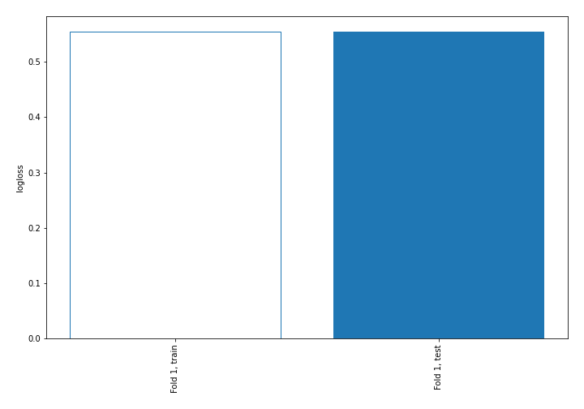
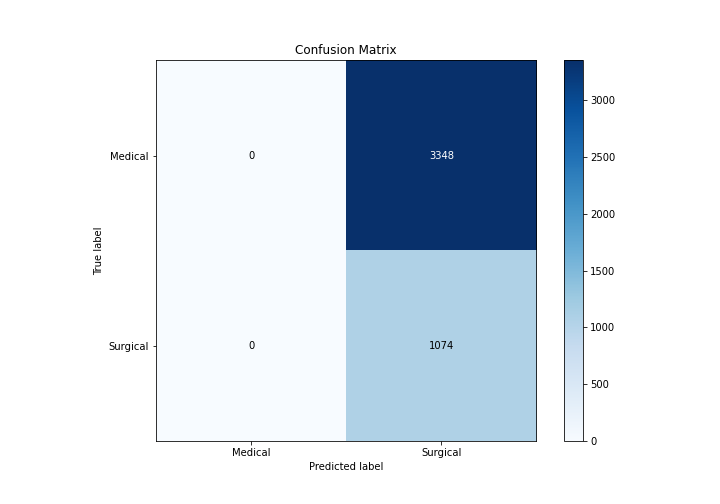
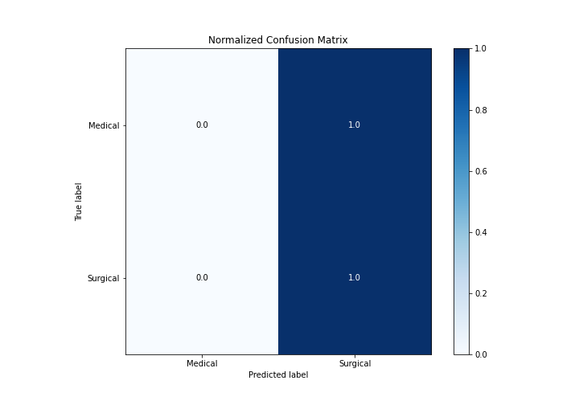
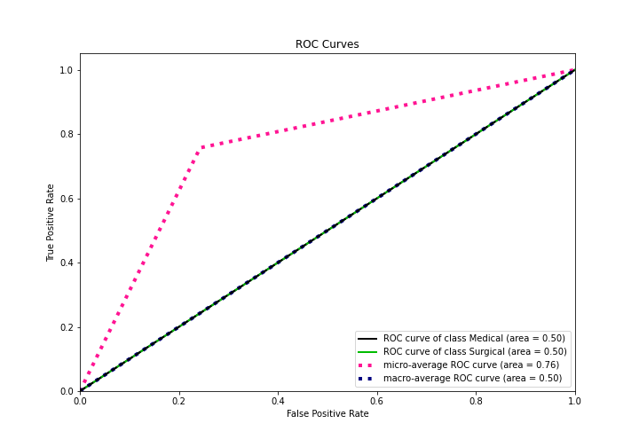
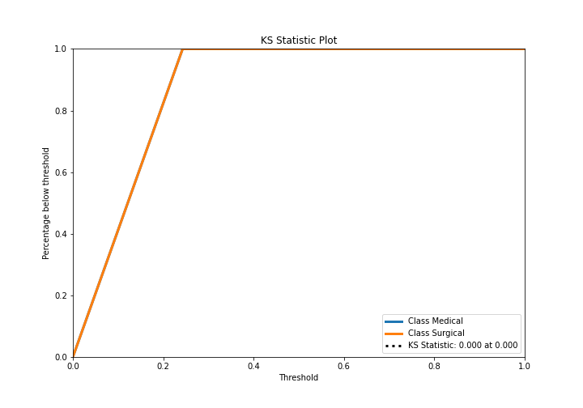
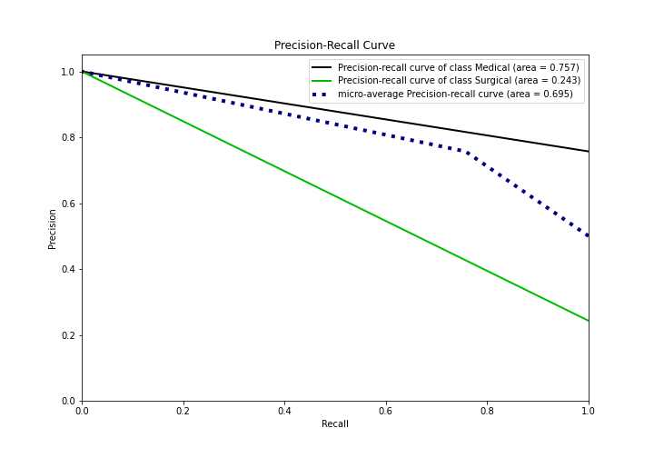
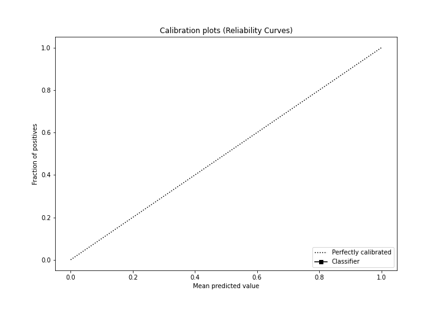
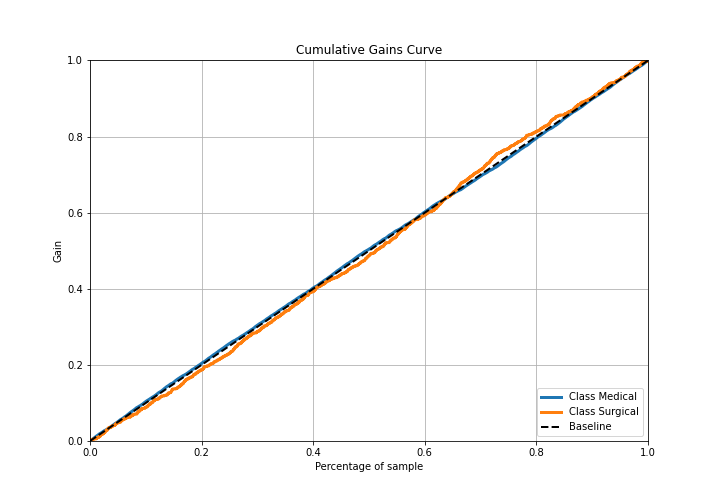
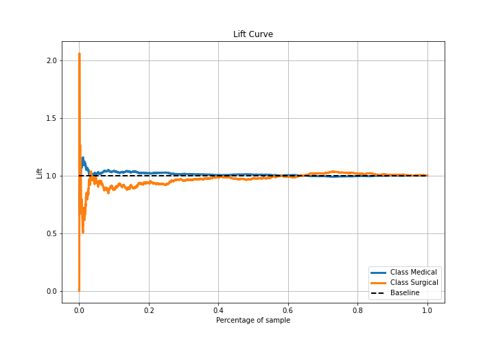

# Summary of 1_Baseline

[<< Go back](../README.md)

## Baseline Classifier (Baseline)
- **n_jobs**: -1
- **explain_level**: 2

## Validation
 - **validation_type**: split
 - **train_ratio**: 0.75
 - **shuffle**: True
 - **stratify**: True

## Optimized metric
logloss

## Training time

0.7 seconds

## Metric details
|           |    score |   threshold |
|:----------|---------:|------------:|
| logloss   | 0.554373 |   nan       |
| auc       | 0.5      |   nan       |
| f1        | 0.39083  |     0.21857 |
| accuracy  | 0.242877 |     0.21857 |
| precision | 0.242877 |     0.21857 |
| recall    | 1        |     0.21857 |
| mcc       | 0        |     0.21857 |

## Metric details with threshold from accuracy metric
|           |    score |   threshold |
|:----------|---------:|------------:|
| logloss   | 0.554373 |   nan       |
| auc       | 0.5      |   nan       |
| f1        | 0.39083  |     0.21857 |
| accuracy  | 0.242877 |     0.21857 |
| precision | 0.242877 |     0.21857 |
| recall    | 1        |     0.21857 |
| mcc       | 0        |     0.21857 |

## Confusion matrix (at threshold=0.21857)
|                     |   Predicted as Medical |   Predicted as Surgical |
|:--------------------|-----------------------:|------------------------:|
| Labeled as Medical  |                      0 |                    3348 |
| Labeled as Surgical |                      0 |                    1074 |

## Learning curves

## Confusion Matrix

## Normalized Confusion Matrix

## ROC Curve

## Kolmogorov-Smirnov Statistic

## Precision-Recall Curve

## Calibration Curve

## Cumulative Gains Curve

## Lift Curve

[<< Go back](../README.md)
