# Summary of 2_DecisionTree

[<< Go back](../README.md)

## Decision Tree
- **n_jobs**: -1
- **criterion**: gini
- **max_depth**: 3
- **explain_level**: 2

## Validation
 - **validation_type**: split
 - **train_ratio**: 0.75
 - **shuffle**: True
 - **stratify**: True

## Optimized metric
logloss

## Training time

17.5 seconds

## Metric details
|           |    score |   threshold |
|:----------|---------:|------------:|
| logloss   | 0.284821 |  nan        |
| auc       | 0.903691 |  nan        |
| f1        | 0.745037 |    0.251308 |
| accuracy  | 0.870647 |    0.694369 |
| precision | 1        |    0.928019 |
| recall    | 1        |    0        |
| mcc       | 0.662072 |    0.251308 |

## Metric details with threshold from accuracy metric
|           |    score |   threshold |
|:----------|---------:|------------:|
| logloss   | 0.284821 |  nan        |
| auc       | 0.903691 |  nan        |
| f1        | 0.653333 |    0.694369 |
| accuracy  | 0.870647 |    0.694369 |
| precision | 0.935764 |    0.694369 |
| recall    | 0.501862 |    0.694369 |
| mcc       | 0.625307 |    0.694369 |

## Confusion matrix (at threshold=0.694369)
|                     |   Predicted as Medical |   Predicted as Surgical |
|:--------------------|-----------------------:|------------------------:|
| Labeled as Medical  |                   3311 |                      37 |
| Labeled as Surgical |                    535 |                     539 |

## Learning curves
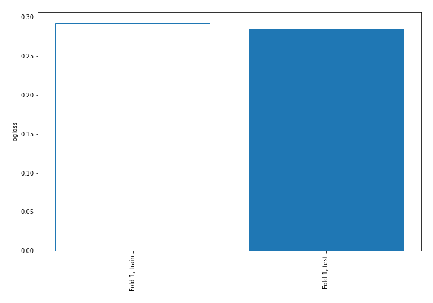

## Decision Tree 

### Tree #1
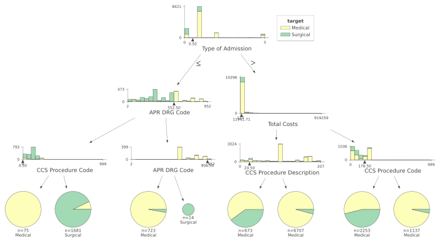

### Rules

if (Type of Admission > 0.5) and (Total Costs <= 11941.71) and (CCS Procedure Description > 24.5) then class: Medical (proba: 95.81%) | based on 6,707 samples

if (Type of Admission > 0.5) and (Total Costs > 11941.71) and (CCS Procedure Code <= 176.5) then class: Medical (proba: 53.93%) | based on 2,253 samples

if (Type of Admission <= 0.5) and (APR DRG Code <= 552.5) and (CCS Procedure Code > 0.5) then class: Surgical (proba: 92.8%) | based on 1,681 samples

if (Type of Admission > 0.5) and (Total Costs > 11941.71) and (CCS Procedure Code > 176.5) then class: Medical (proba: 96.57%) | based on 1,137 samples

if (Type of Admission <= 0.5) and (APR DRG Code > 552.5) and (APR DRG Code <= 906.5) then class: Medical (proba: 97.23%) | based on 723 samples

if (Type of Admission > 0.5) and (Total Costs <= 11941.71) and (CCS Procedure Description <= 24.5) then class: Medical (proba: 60.03%) | based on 673 samples

if (Type of Admission <= 0.5) and (APR DRG Code <= 552.5) and (CCS Procedure Code <= 0.5) then class: Medical (proba: 100.0%) | based on 75 samples

if (Type of Admission <= 0.5) and (APR DRG Code > 552.5) and (APR DRG Code > 906.5) then class: Surgical (proba: 100.0%) | based on 14 samples

## Permutation-based Importance
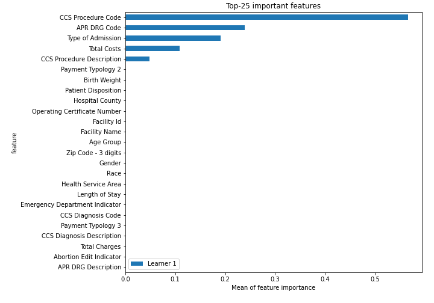
## Confusion Matrix

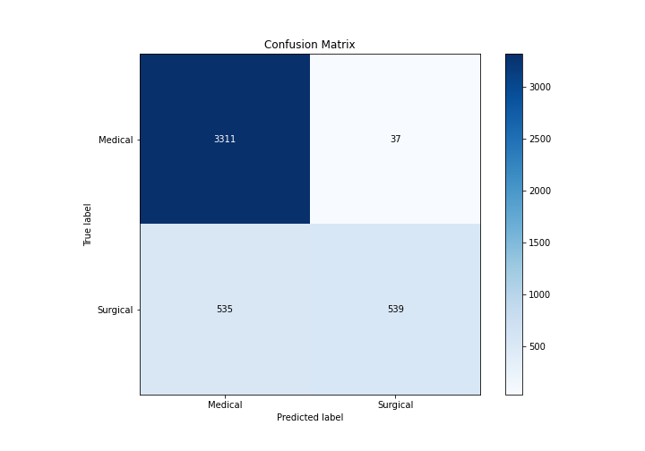

## Normalized Confusion Matrix

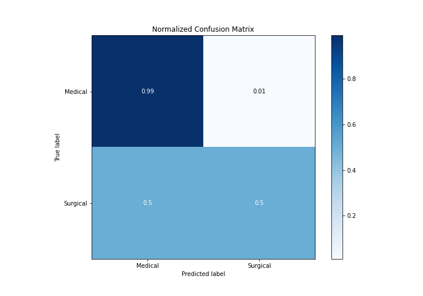

## ROC Curve

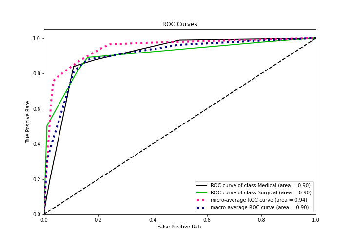

## Kolmogorov-Smirnov Statistic

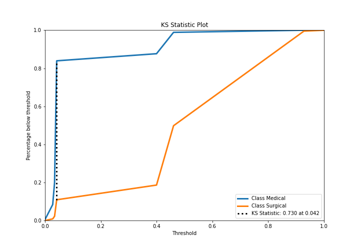

## Precision-Recall Curve

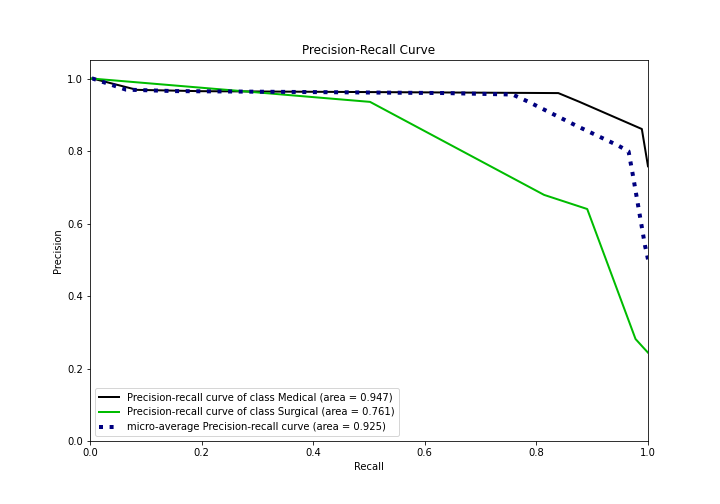

## Calibration Curve

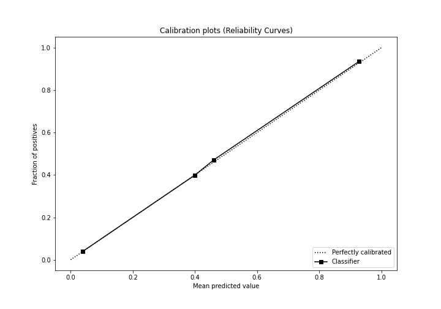

## Cumulative Gains Curve

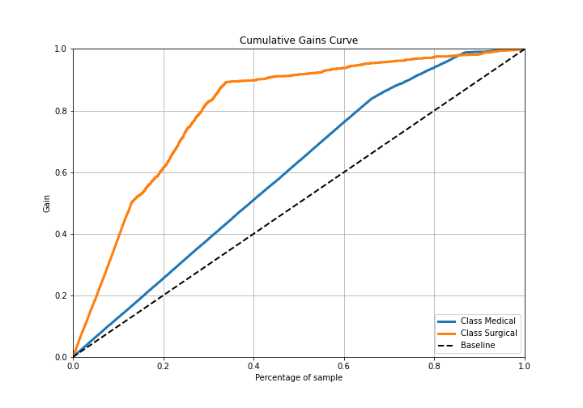

## Lift Curve

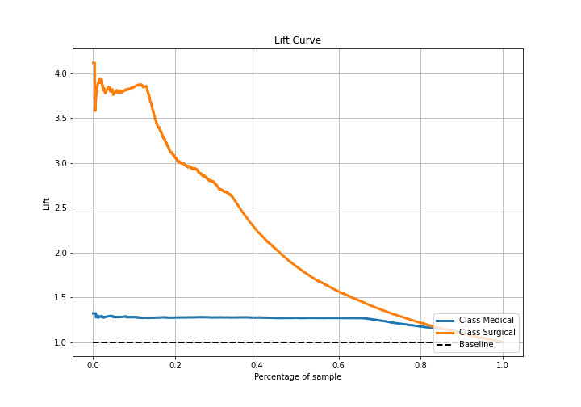

## SHAP Importance
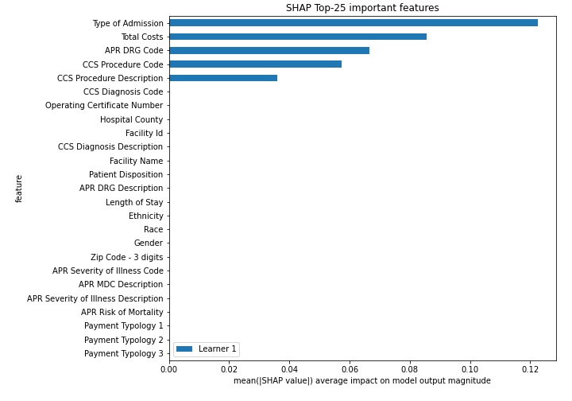

## SHAP Dependence plots

### Dependence (Fold 1)
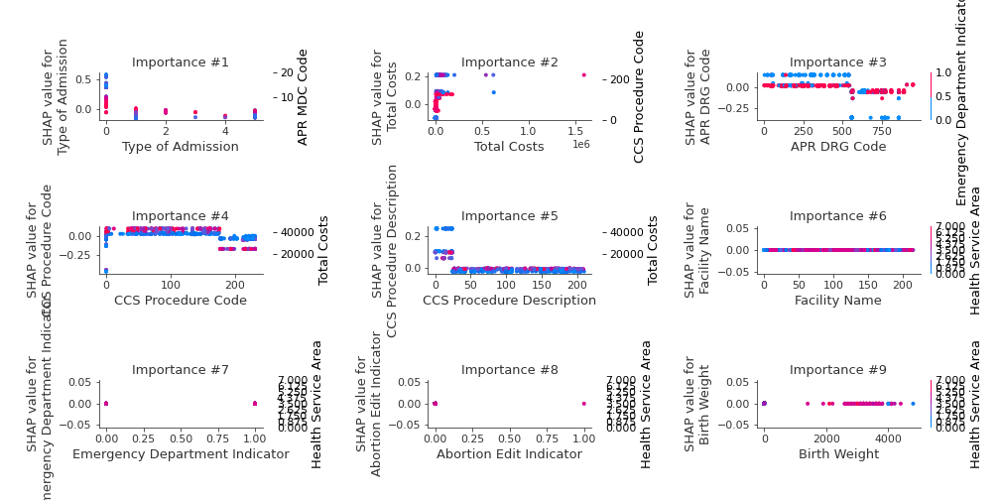

## SHAP Decision plots

### Top-10 Worst decisions for class 0 (Fold 1)
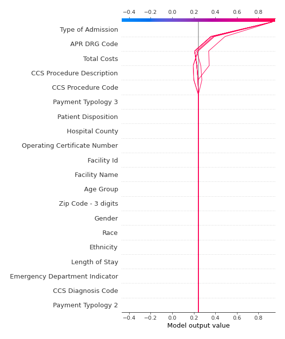
### Top-10 Best decisions for class 0 (Fold 1)
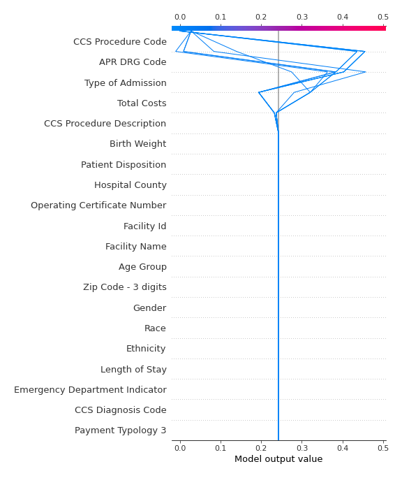
### Top-10 Worst decisions for class 1 (Fold 1)
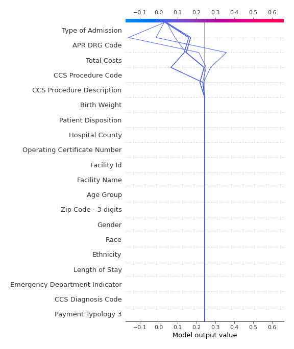
### Top-10 Best decisions for class 1 (Fold 1)
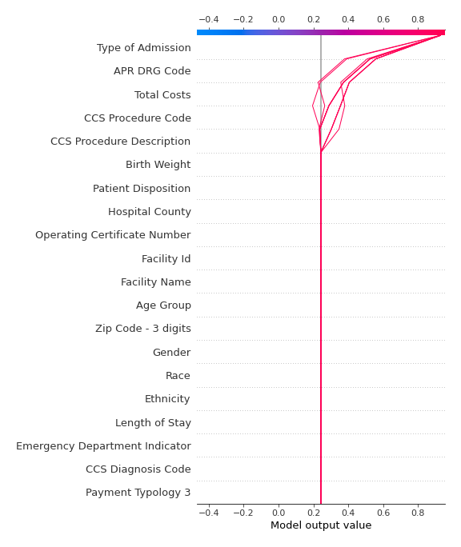

[<< Go back](../README.md)
