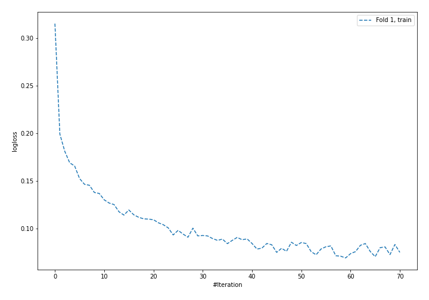
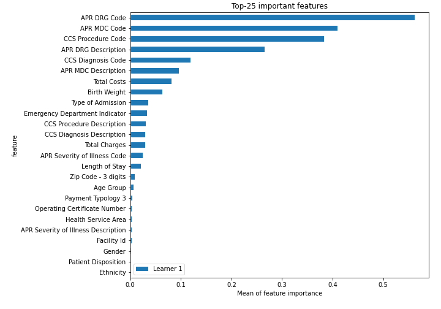
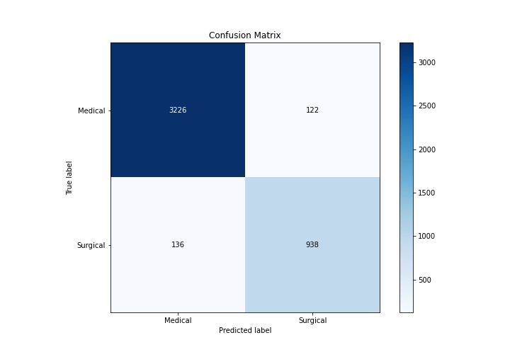
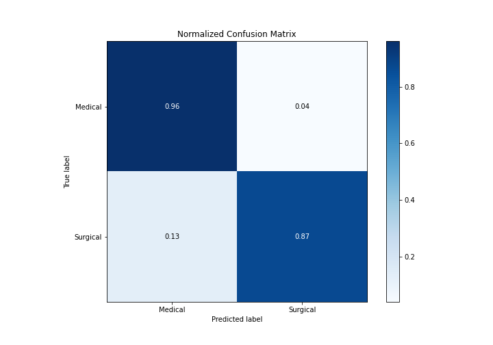
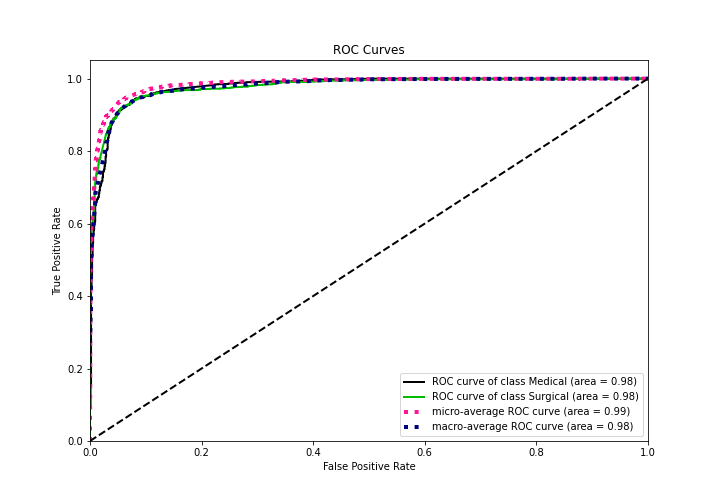
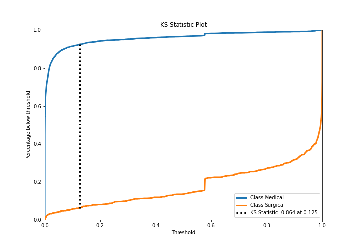
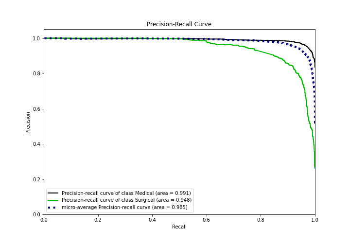
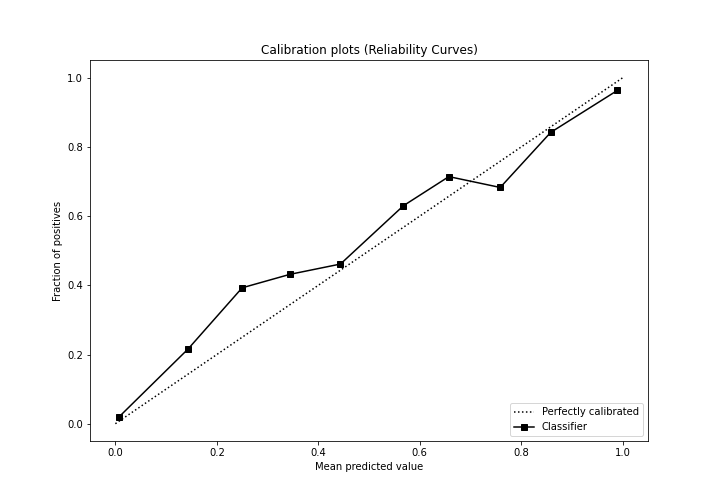
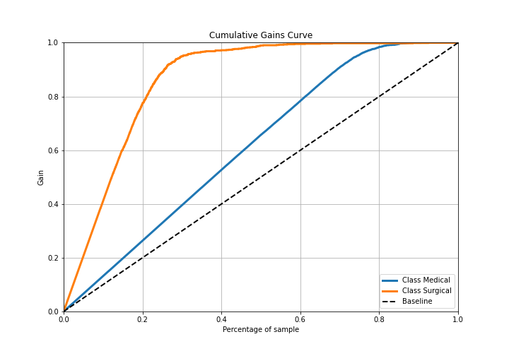
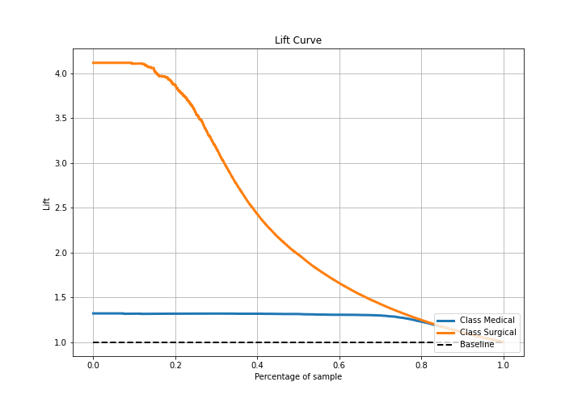

# Summary of 4_Default_NeuralNetwork

[<< Go back](../README.md)

## Neural Network
- **n_jobs**: -1
- **dense_1_size**: 32
- **dense_2_size**: 16
- **learning_rate**: 0.05
- **explain_level**: 2

## Validation
 - **validation_type**: split
 - **train_ratio**: 0.75
 - **shuffle**: True
 - **stratify**: True

## Optimized metric
logloss

## Training time

9.4 seconds

## Metric details
|           |    score |     threshold |
|:----------|---------:|--------------:|
| logloss   | 0.169421 | nan           |
| auc       | 0.977523 | nan           |
| f1        | 0.8791   |   0.441499    |
| accuracy  | 0.941655 |   0.441499    |
| precision | 1        |   0.999897    |
| recall    | 1        |   2.04069e-11 |
| mcc       | 0.840684 |   0.441499    |

## Metric details with threshold from accuracy metric
|           |    score |   threshold |
|:----------|---------:|------------:|
| logloss   | 0.169421 |  nan        |
| auc       | 0.977523 |  nan        |
| f1        | 0.8791   |    0.441499 |
| accuracy  | 0.941655 |    0.441499 |
| precision | 0.884906 |    0.441499 |
| recall    | 0.873371 |    0.441499 |
| mcc       | 0.840684 |    0.441499 |

## Confusion matrix (at threshold=0.441499)
|                     |   Predicted as Medical |   Predicted as Surgical |
|:--------------------|-----------------------:|------------------------:|
| Labeled as Medical  |                   3226 |                     122 |
| Labeled as Surgical |                    136 |                     938 |

## Learning curves

## Permutation-based Importance

## Confusion Matrix

## Normalized Confusion Matrix

## ROC Curve

## Kolmogorov-Smirnov Statistic

## Precision-Recall Curve

## Calibration Curve

## Cumulative Gains Curve

## Lift Curve

[<< Go back](../README.md)
