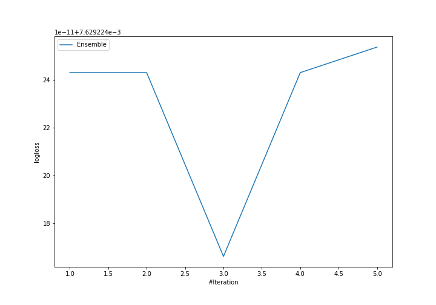
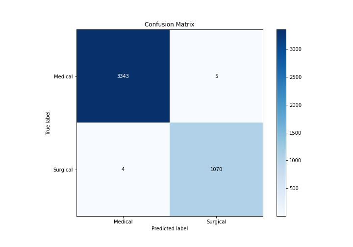
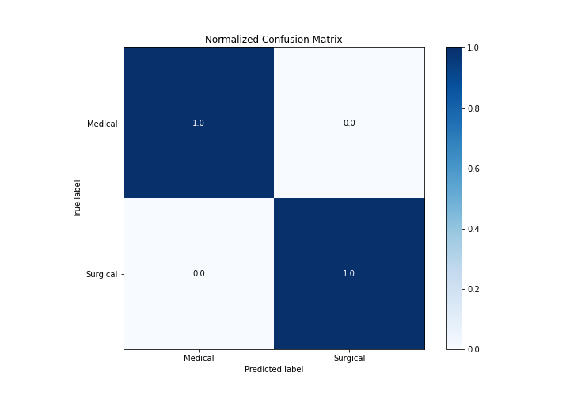
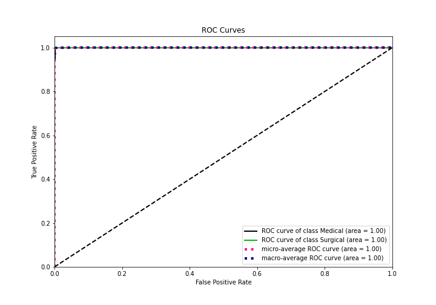
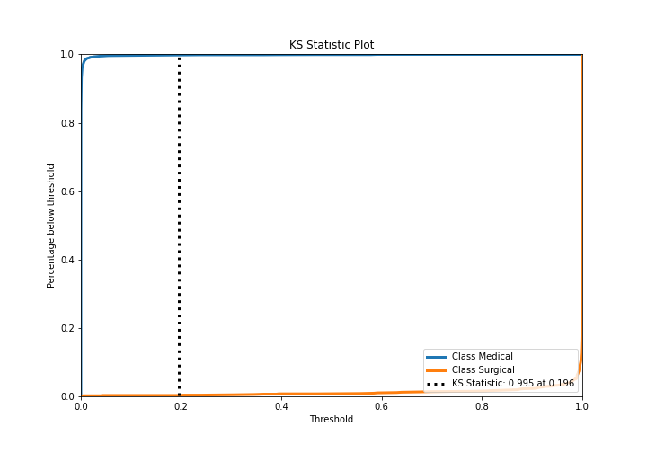
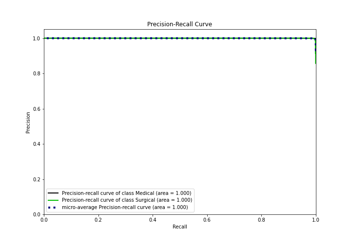
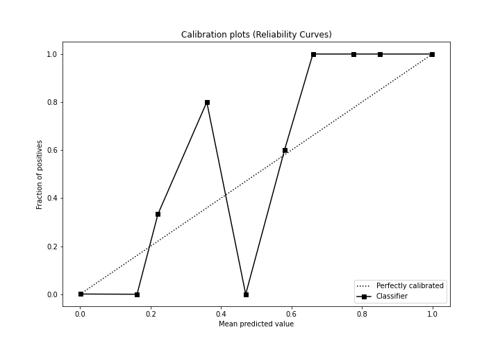
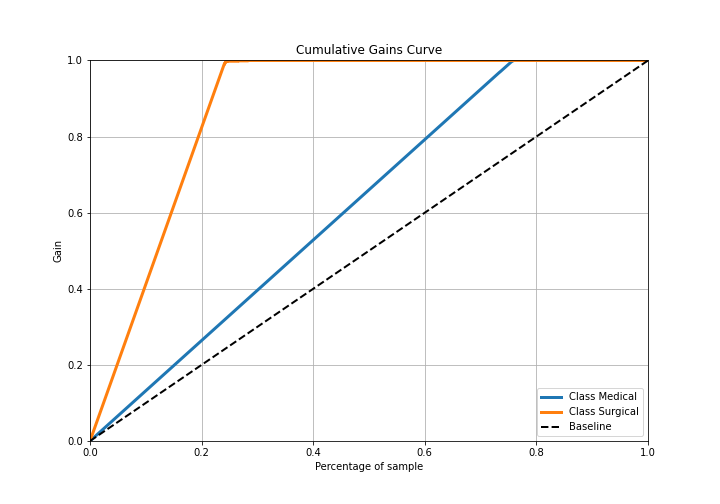
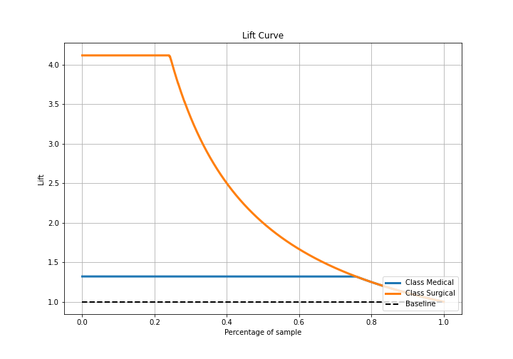

# Summary of Ensemble

[<< Go back](../README.md)

## Ensemble structure
| Model             |   Weight |
|:------------------|---------:|
| 3_Default_Xgboost |        3 |

## Metric details
|           |      score |     threshold |
|:----------|-----------:|--------------:|
| logloss   | 0.00762922 | nan           |
| auc       | 0.99991    | nan           |
| f1        | 0.995812   |   0.235033    |
| accuracy  | 0.997965   |   0.235033    |
| precision | 1          |   0.998556    |
| recall    | 1          |   1.39117e-07 |
| mcc       | 0.994468   |   0.235033    |

## Metric details with threshold from accuracy metric
|           |      score |   threshold |
|:----------|-----------:|------------:|
| logloss   | 0.00762922 |  nan        |
| auc       | 0.99991    |  nan        |
| f1        | 0.995812   |    0.235033 |
| accuracy  | 0.997965   |    0.235033 |
| precision | 0.995349   |    0.235033 |
| recall    | 0.996276   |    0.235033 |
| mcc       | 0.994468   |    0.235033 |

## Confusion matrix (at threshold=0.235033)
|                     |   Predicted as Medical |   Predicted as Surgical |
|:--------------------|-----------------------:|------------------------:|
| Labeled as Medical  |                   3343 |                       5 |
| Labeled as Surgical |                      4 |                    1070 |

## Learning curves

## Confusion Matrix

## Normalized Confusion Matrix

## ROC Curve

## Kolmogorov-Smirnov Statistic

## Precision-Recall Curve

## Calibration Curve

## Cumulative Gains Curve

## Lift Curve

[<< Go back](../README.md)
